# Acquisition funnel audit

Audit date: 2026-09-23. Production baseline precedes the deployment containing this document.

## Executive finding

The assessment itself could advance when answered, but the required-question state made **Continue** a disabled, inert control with no explanation. That matches the reported rage-click behavior: taps on a disabled button cannot run validation, focus the missing input, or emit a useful diagnostic event. A second defect made the analytics interpretation unreliable: visitors who entered the assessment directly or from the homepage did not receive a durable anonymous funnel session, so 38 question-answer events appeared as 38 separate actors.

The remediation keeps Continue actionable, explains missing input, moves focus to the question, prevents duplicate transitions, assigns every visitor a durable first-party session, and instruments each stage without collecting answers or health free text.

## Production baseline

Thirty-day database observation before remediation:

| Signal | Result |
| --- | ---: |
| Social landing views | 843 events / 772 recorded actors |
| Social primary CTA clicks | 3 |
| Assessment starts | 8 |
| Question answered | 38 events incorrectly counted as 38 actors |
| Assessment complete | 1 |
| Preview viewers | 2 |
| Checkout starts | 1 |

These figures must not be treated as a clean conversion baseline. The anomalous 843 landing views, low CTA volume, and missing session continuity warrant bot/preview and event-delivery investigation. The system now stores a conservative user-agent `bot_signal` for investigation, but does **not** silently discard that traffic or invent a filtering rule.

## Actual funnel before remediation

```mermaid
flowchart LR
  Social[Social link / short route] --> Start[/start]
  Start -->|CTA| Assess[/assessment]
  Home[/ homepage gateway] --> Assess
  Assess -->|required answer absent| Inert[Disabled Continue; no feedback]
  Assess -->|answered| Questions[Dynamic assessment questions]
  Questions --> Review[Review]
  Review --> Blueprint[/blueprint preview]
  Blueprint --> Signup[Account creation]
  Signup --> Verify[Email verification]
  Verify --> Checkout[Checkout]
  Checkout --> Paid[Subscription]
```

## Intended and instrumented funnel

```mermaid
flowchart LR
  Entry[Social / homepage] --> Landing[Landing view + durable session]
  Landing --> CTA[Primary CTA click]
  CTA --> Loaded[Assessment loaded]
  Loaded --> Start[Assessment start]
  Start --> Q[Question viewed]
  Q -->|invalid| Validation[Visible validation + focus]
  Validation --> Q
  Q -->|valid, guarded| Answered[Answer persisted + answered event]
  Answered --> Q
  Answered --> Complete[Assessment complete]
  Complete --> Preview[Blueprint preview]
  Preview --> Signup[Signup start / complete]
  Signup --> Verify[Email verification complete]
  Verify --> Checkout[Checkout view / start]
  Checkout --> Paid[Subscription complete]
```



## Route and attribution verification

Production returned HTTP 200 for `/` and `/start`. `/t`, `/i`, `/x`, `/r`, `/f`, `/y`, and `/l` returned temporary 307 redirects to `/start` with platform source and entry path. Existing UTM parameters were preserved by Next.js in production. First touch, last touch, first/last seen timestamps, landing path, session ID, route, source, medium, campaign, content, variant, device, browser, deployment version, and assessment version are now retained. Attribution is first-party local storage and survives assessment navigation and refresh.

Homepage and `/start` both expose a primary assessment action above the fold. `/start` remains the social-specific landing experience; the homepage gateway is a separate first-entry experience. No assessment shortening, pricing change, or site redesign was introduced.

## Canonical event definitions

| Event | Exact trigger |
| --- | --- |
| `social_landing_view` | `/start` client is ready and attribution is stored |
| `social_primary_cta_click` | visitor activates a `/start` assessment CTA |
| `assessment_loaded` | saved assessment state has been read and the assessment can render; once per tab/version |
| `assessment_start` | a new assessment becomes actionable; once per tab/version |
| `assessment_question_viewed` | a specific visible question renders |
| `assessment_continue_click` | every Continue activation, with only validity and question metadata |
| `assessment_validation_error` | Continue is activated without a required response |
| `assessment_question_answered` | a valid question transition is accepted; includes dwell time, never the answer |
| `assessment_save_failed` | browser storage rejects assessment persistence |
| `assessment_25/50/75_percent` | first crossing of the named completion threshold |
| `assessment_complete` | visitor requests Blueprint creation from review |
| `assessment_preview_view` | generated Blueprint preview renders |
| `signup_start` / `signup_complete` | account flow begins / account creation succeeds |
| `email_verification_complete` | verified authentication callback succeeds |
| `checkout_view` / `checkout_start` | pricing/checkout is viewed / Stripe Checkout creation is requested |
| `subscription_complete` | trusted billing webhook records an active subscription |
| `funnel_error` | a categorized acquisition failure occurs; no sensitive text is included |

Once-only lifecycle events use a session-storage deduplication key. Repeated question events retain question number/key so legitimate progression remains observable. Rapid duplicate Continue activations are guarded synchronously.

## Reporting and privacy

`/app/admin/acquisition` now reports source funnel counts, step and overall conversion, Q5/Q10/Q20 reach, per-question views/answers/validation errors/median time, staff/test inclusion, browser/device/campaign/variant/build filters, bot signals, and the latest safe delivery records. A qualified session means a unique first-party session with at least one accepted funnel event. Assessment answers, medical context, notes, symptoms, and health free text are prohibited by the server privacy filter.

Staff and QA exclusion is explicit through `profiles.is_internal` and `profiles.is_test_user`; anonymous test traffic can still be identified by its source/campaign/session in the debug table. Builds are labeled with the Vercel git SHA so pre/post comparison can use deployment boundaries rather than guesswork.

## Device and performance verification scope

Automated component tests cover invalid Continue feedback, valid progression, and rapid duplicate protection. Automated route tests cover every short-route mapping; production HTTP checks verified that all seven platform routes return temporary redirects while preserving campaign parameters. Durable attribution and deduplication have direct automated coverage. Code review covers the responsive 375–430px rules, but the configured environment does not include the Chrome DevTools performance MCP required for a trace. It also cannot prove physical iOS Safari, Android Chrome, or every social in-app browser. Those remain explicit physical-device smoke-test items after deployment rather than being represented as completed coverage.

No A/B test was added. The immediate priority is trustworthy observability and a working baseline.
